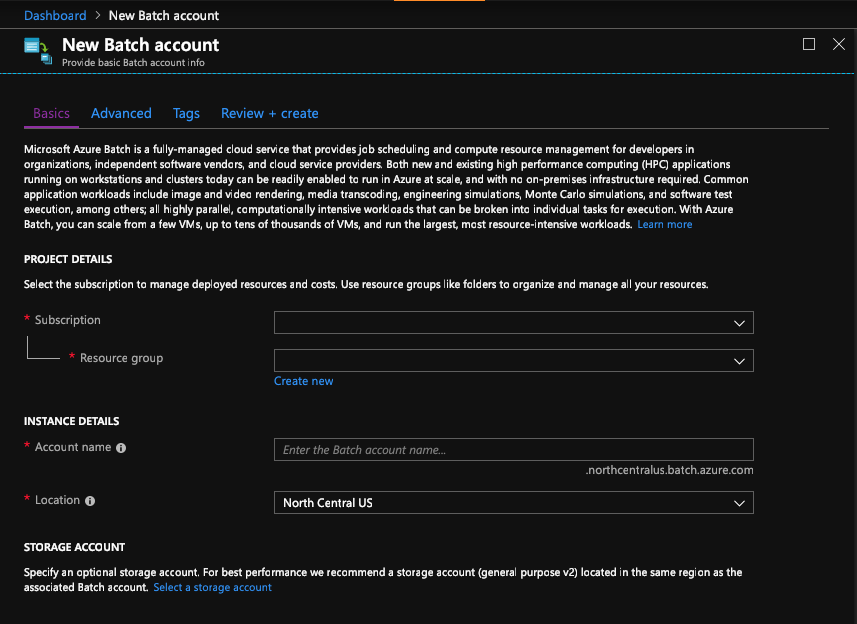
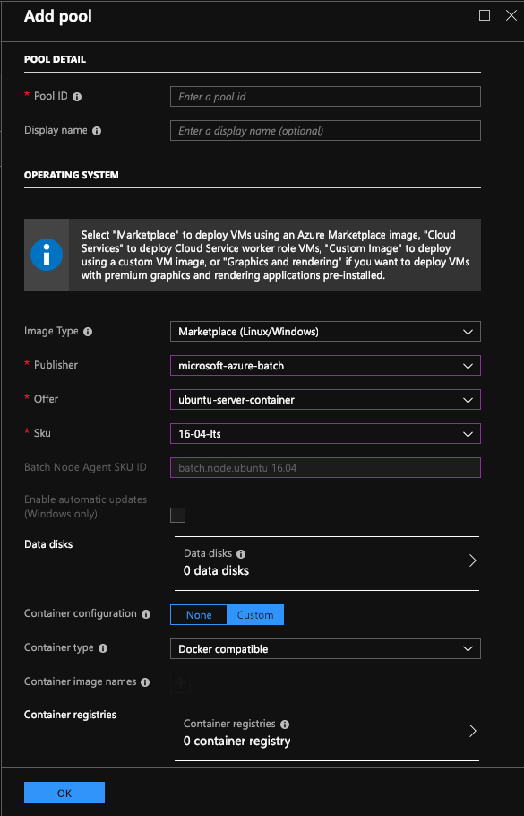

# Overview

Training a Bonsai BRAIN can take some time depending on how long your simulation
model needs to run a single iteration. One way to speed up training is to run
more than a single simulation at a time. This step-by-step guide describes how
to use docker containers and Azure Batch to run as many simulations in parallel
as needed.

### [Azure Batch](https://azure.microsoft.com/en-us/services/batch/)

Azure Batch creates and manages a pool of compute nodes (virtual machines),
installs the applications you want to run, and schedules jobs to run on the
nodes. There is no cluster or job scheduler software to install, manage, or
scale. Instead, you use [Batch APIs andtools](https://docs.microsoft.com/en-us/azure/batch/batch-apis-tools), command-line scripts, or
the Azure portal to configure, manage, and monitor your jobs.

### What is a Pool?

Pool nodes are the VMs that execute your tasks. Specify properties such as the
number and size of the nodes, a Windows or Linux VM image, and an application to
install when the nodes join the pool. Manage the cost and size of the pool by
using [low-priority VMs](https://docs.microsoft.com/en-us/azure/batch/batch-low-pri-vms) or [automatically scaling](https://docs.microsoft.com/en-us/azure/batch/batch-automatic-scaling) the number of nodes as the workload changes. 

### What is a Job?

A Batch job is a logical group for one or more tasks. A job includes settings
common to the tasks, such as priority and the pool to run tasks on. Initially
the job has no tasks.

### What is a Task?

A task is the actual description of the workload you want to run on the pool.
When you add tasks to a job, the Batch service automatically schedules the tasks
for execution on the compute nodes in the pool. Each task uses the application
that you uploaded to process the input files.

### [Docker Container](https://www.docker.com/)

A container is a standard unit of software that packages up code and all its
dependencies, so the application runs quickly and reliably from one computing
environment to another. A Docker container image is a lightweight, standalone,
executable package of software that includes everything needed to run an
application: code, runtime, system tools, system libraries and settings. In this
example, we’re using a Linux based docker container to run a python-based
simulation with the Bonsai platform but there is no reason it wouldn’t run with
a Windows based docker container.

### Azure Container Registry (ACR)

https://azure.microsoft.com/en-us/services/container-registry/

Azure Container Registry allows you to store images for all types of container
deployments including Docker. This is the location where your packed docker
container needs to reside, so tasks can access it as needed.

## Before you start
Make sure you have the following pre-requisites before you start:

-   Bonsai Platform account
-   Bonsai CLI installed on your local machine
-   A python-based simulation that is set-up to work with the Bonsai platform
    and runs on Linux. All needed files should reside in one directory
-   Docker installed
-   Azure account
-   [Azure CLI installed]
    (<https://docs.microsoft.com/en-us/cli/azure/install-azure-cli?view=azure-cli-latest>)
-   Local user account with administrator privileges
-   Git (if you want to use one of Bonsai’s simulations)

## Your worksheet
Copy this table to a file and capture names and other information that you’ve
 picked during the process. You will need to use these at later steps.

```
| Item                      | Placeholder           | Your data           |
| ------------------------- | --------------------- | ------------------- |
| Azure-Subscription ID     | <Azure-SubId>         |                     |
| Resource Group:           | <your-resource-group> |                     |
| ACR name:                 | <your-ACR>            |                     |
| ACR URL:                  | <your-ACR>.azurecr.io |                     |
| Azure batch account name: | <your-batch-account>  |                     |
| Batch pool ID:            | <your-pool-id>        |                     |
| Pool job name             | <your-job-name>       |                     |
| Simulation name:          | <your-simulation>     |                     |
| Bonsai username           | <bonsai_username>     |                     |
| Bonsai access key         | <bonsai_accesskey>    |                     |
| Bonsai BRAIN              | <bonsai_brain_name>   |                     |
| Bonsai URL                | <bonsai_url>          | https://api.bons.ai |
```
# Bonsai example

Step-by-step instructions for training a Bonsai BRAIN using a docker
container and Azure Batch.

## Create an Azure Container Registry (ACR)

Use an existing ACR or create a new one. The Azure Container Registry must have
"Admin user" setting enabled to generate credentials which will be used by Azure
Batch Pool to pull the container images of the simulations. 

Create ACR via Azure CLI or via Azure Portal 

-   <https://docs.microsoft.com/en-us/azure/container-registry/container-registry-get-started-azure-cli>  

-   <https://docs.microsoft.com/en-us/azure/container-registry/container-registry-get-started-portal> 

## Create an Azure Batch account (Batch Service)

Create Azure Batch Account with "Pool Allocation Mode" as "Batch Service". 

<https://docs.microsoft.com/en-us/azure/batch/batch-account-create-portal> 



Capture your batch account name in the worksheet above.

## Create a Pool

We’re using a single pool with for this example. You can create multiple pools
to create dedicated pools for each of your simulations or re-use a single pool
for different simulations. Either way, you don’t need to shut down and re-create
the pool(s) every time.



PoolId: *\<your-pool-id\>*

Select Image settings: 

Image Type: Marketplace 

Publisher: microsoft-azure-batch (*specific to running Linux containers*) 

Offer: ubuntu-server-container (*specific to running Linux containers*) 

Sku: 16-04-lts (*specific to running Linux containers*) 

Container settings: Custom

Scale settings: 1 node

For getting your workflow set up correctly, start with a single node and
increase scale over time once you’ve validated that everything works.

## Create a docker for your Simulation

This step assumes you’re familiar with docker fundamentals. Please review
<https://docs.docker.com/get-started/> if you have not used docker before.

We’re using a command line interface for the next steps (“cmd” on Windows,
“terminal.app” on macOS and your preferred terminal app on Linux).

### Azure Sign-In
>Login to ACR

```
az login 

az account set -subscription -s <Azure-SubId> 

az acr login --resource-group <your-resource-group> --name <your-acr> 
```

Use the Azure CLI to log into your Azure Container Registry. You need your
Azure Subscription-ID, Azure Resource-Group and ACR-ID at this point.

```
cd <~/your-simulation/>
```

###Create Docker Image

>Copy and paste the following into your Dockerfile

```
FROM ubuntu:16.04  

ADD *\<first-file-in-your-simulation-directory\>* /simulation/*\<first-file\>*

ADD *\<second-file…\>*

RUN apt-get update && apt-get install -y --no-install-recommends && apt-get upgrade -y 
RUN apt-get install python3 python3-pip -y --no-install-recommends 
RUN pip3 install setuptools wheel 
RUN pip3 install -r */\<path-to-requirements\>*/requirements.txt 
```

Navigate to the simulation you want to use for training. If you don’t have one,
there are a number of examples on the Bonsai [github](https://github.com/BonsaiAI).
Clone your selection and enter the directory.

Use your preferred editor for creating a Dockerfile:

You need to add all needed simulation files including bonsai related files into
the docker container by using the “ADD” command. It’s advised to not add the
.bonsai file as it includes your private access key that you should keep
secret.

Create your Dockerfile and use additional ADD statements until all needed files
are added. Point to the correct directories to match your local directory structure.


Now go back to your command line interface and build the docker image.

>Build docker image and assign ID

```
IMAGE_ID=$(docker build -q --no-cache --network=host . 2>/dev/null | awk 'sha256:{print $NF}') 

echo $IMAGE_ID 
```

>Tag the image and assign a version

```
docker tag $IMAGE_ID <your-acr>.azurecr.io/<your-simulation>:1.0
```

>Push the image to ACR  

```
docker push <your-acr>.azurecr.io/<your-simulation>:1.0 
```

Note: Use version numbers as you see fit.

## Start training your Bonsai BRAIN locally
>Pull Image and test it

```
docker pull <your-acr>.azurecr.io/<your-simulation>:1.0 

docker run --rm -it <your-acr>.azurecr.io/<your-simulation>:1.0 python3 <your-sim-start>.py --brain <bonsai_brain_name> - url <bonsai_url> --username <bonsai_username> --accesskey <bonsai_accesskey>  
```
Start your BRAIN training by using <http://beta.bons.ai> or the Bonsai CLI.

This guide assumes you’re experienced with using the Bonsai platform using a
local machine for running simulations. Please visit <http://docs.bons.ai> for
further information

At this point, your simulation model should run in the docker container and send
the correct output to standard out.

## Simulation Deployment
> Login to Azure Batch Account 

```
az batch account login --resource-group <your-resource-group> --name <your-batch-account>
```
First, login into your Azure account, then deploy your simulation on Azure and
start training using jobs & tasks.
> Create a Job and run it on your pool

```
az batch job create --id <your-job-name> --pool-id <your-pool-id>
```

###Create a job
Jobs are containing multiple tasks and run on your pool.

>Copy and Paste into task.json

```
[ 

         { 

         "id": "simulation-task-1", 

         "displayName": "Simulation", 

         "commandLine": "python3 /simulation/<your-sim-start> --url <bonsai_url> --username <bonsai_username> --accesskey <bonsai_accesskey>", 

         "constraints": { 

             "maxTaskRetryCount": 0, 

             "maxWallClockTime": "P10D" 

         }, 

         "containerSettings": { 

             "containerRunOptions": null, 

             "imageName": "<your-acr>.azurecr.io/<your-simulation>:1.0", 

             "registry": null 

         }, 

         "environmentSettings":[] 

     } 

 ]
```
  
### Create tour first task
```
az batch task create --job-id <your-job-name> --json-file ./task.json 
```
Use your preferred editor and create a file named “task.json”. This allows you
to simplify managing parameters when creating tasks. Please copy and paste the
 content to the right into your editor and update \<your-sim-start>,\<bonsai_url>,
  \<bonsai_username>,\<bonsai_accesskey,\<your-sim-start>,\<your-acr>.

Run the `az batch` command, it will create a task with the id “simulation-task-1”.

Create additional tasks by modifying the task.json file as needed.

More background on jobs and tasks can be found here:
<https://docs.microsoft.com/en-us/azure/batch/scripts/batch-cli-sample-run-job>

You can create additional jobs using the “Create Job” step with a different
“job-id” and then use the “az batch task create …” command to assign a task to
that newly created job. This could be useful if you want to associate jobs with
differently configured pools.

## View progress of your training

Visit <https://beta.bons.ai>, go to your dashboard and select the BRAIN you are
currently training. It’s recommended to validate that data from the simulator is
being fed into the Brain by monitoring the simulation tab of the training graph.
At this point, training status should have changed to “Simulator: Connected”.

## Check log files

If the simulator won’t connect and no data is arriving at the BRAIN, please
review the log files associated with your Azure Batch pool. Go to
<https://portal.azure.com> and navigate to your Azure Batch Pool. Select the
node in your pool and enter the “files” section. If anything went wrong, error
files should show up at this location and provide more details of the problem.
This assumes that your locally executed container worked, and you’ve created a
pool based on a single node.  
On <http://beta.bons.ai> you will see standard out from one of the simulators
when training is running and a simulator is connected. It should show the same
standard console output that you expect when running the docker container
manually on your local machine.

## Clean-up
>Terminate completed jobs

```
az batch job set --job-id <you-job-id> --on-all-tasks-complete terminatejob
```
If you plan to use a single pool to run multiple simulation jobs, we recommend
shutting down the individual jobs unless you’ve created a single pool for a
dedicated simulator. In that case, you can also shut down the pool itself. This
command terminates your job once all tasks have been completed.
